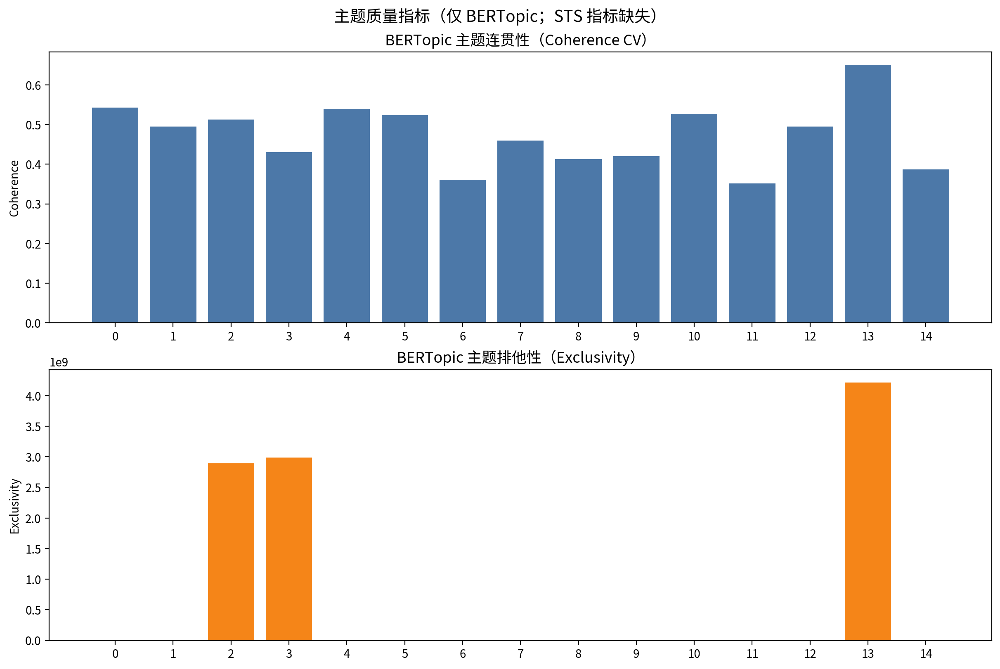
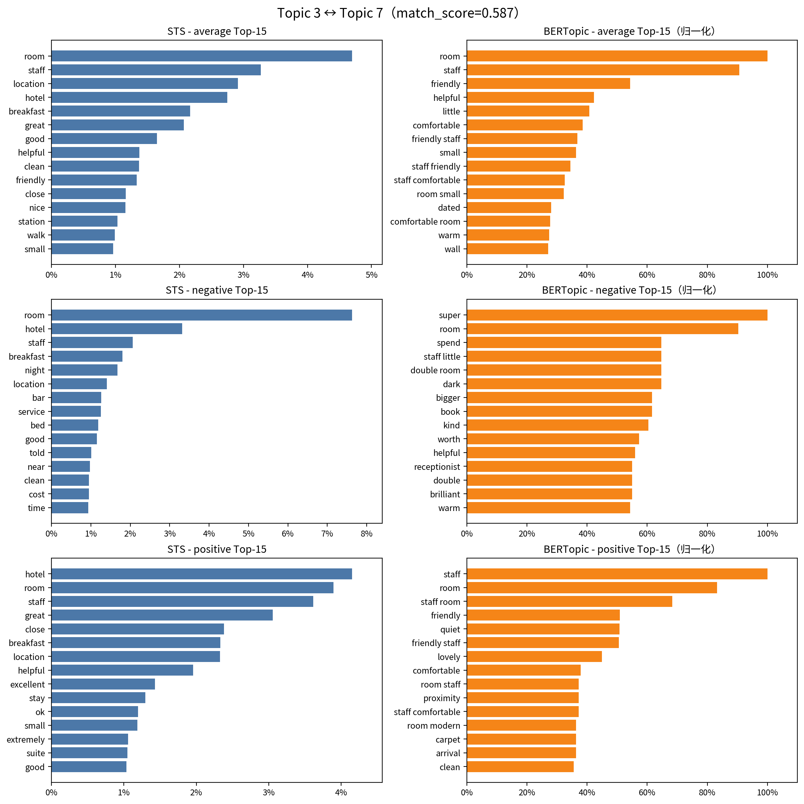
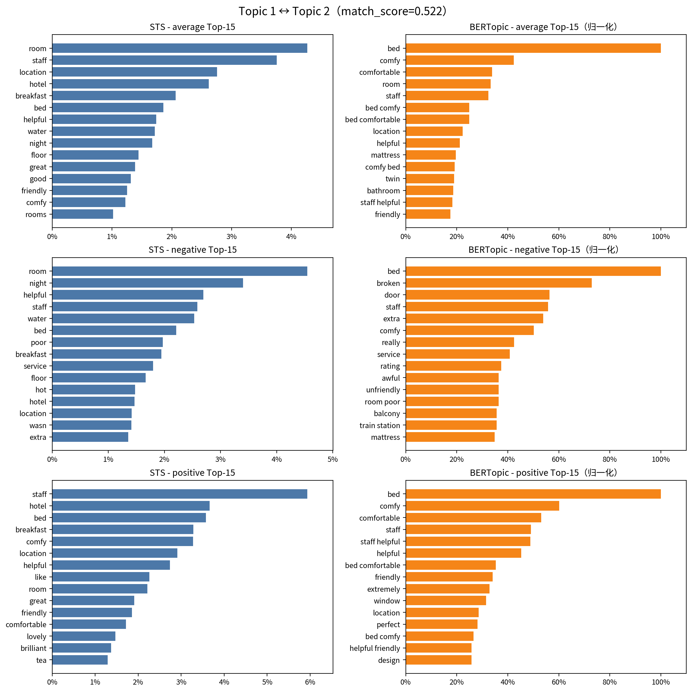
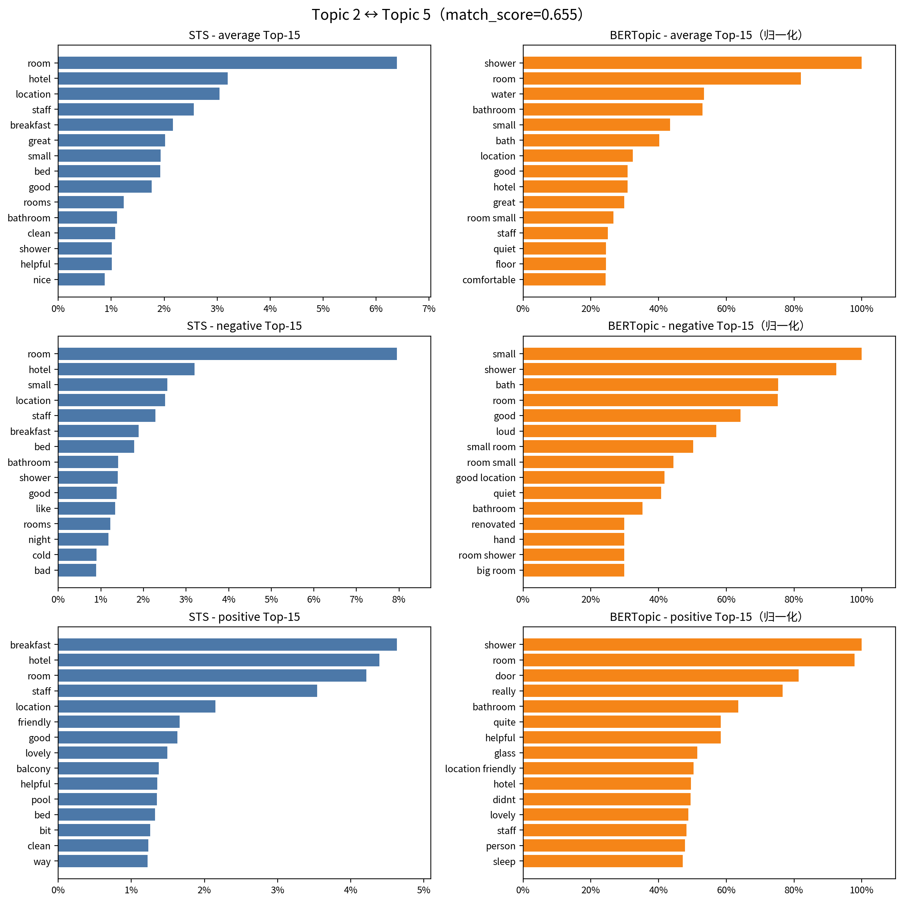
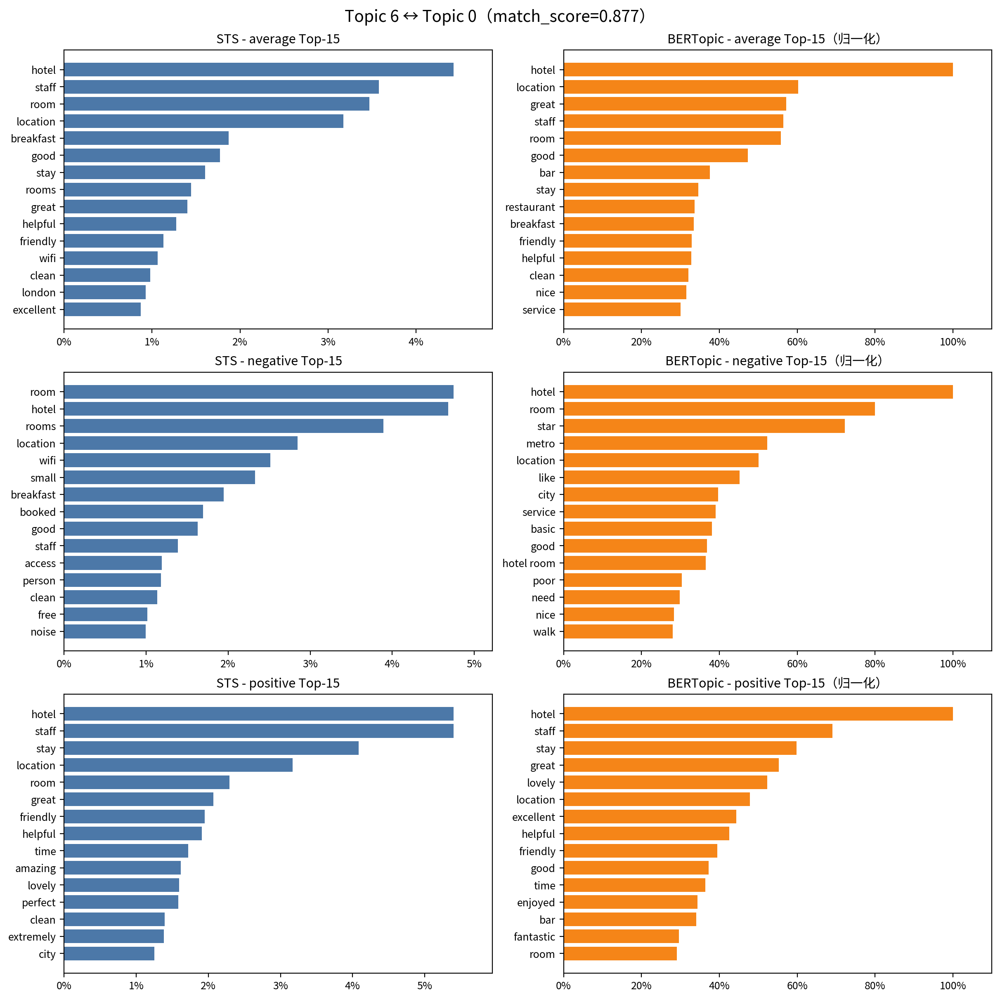

## STS 与 BERTopic 主题热词对比分析

本文档旨在对比分析两种主题模型——传统的结构化主题模型（STS）与先进的基于嵌入的 BERTopic 模型——在处理酒店评论数据时的热词提取效果。我们为每个 STS 主题找到了最匹配的 BERTopic 主题，并生成了一系列并排对比图，直观展示了它们在**平均（Average）**、**负向（Negative）**和**正向（Positive）**三种情感设定下的 Top-15 热词差异。

### 数据与方法
- **原模型 (STS)**：基于 `sts_hotel_sample_1k` 项目的输出，热词概率直接来源于其模型结果。
- **新模型 (BERTopic)**：使用 `all-MiniLM-L6-v2` 句向量模型对评论文本进行嵌入，再通过 BERTopic 进行主题建模。热词得分（c-TF-IDF）经过归一化处理以便与 STS 的概率进行比较。
- **主题映射**：通过计算 STS 与 BERTopic 主题词分布的余弦相似度，为每个 STS 主题找到了最匹配的 BERTopic 主题。
- **情感设定**：两种模型均基于评论的打分（`Reviewer_Score`），取其分布的 10%、均值和 90% 分位点，分别代表**负向**、**平均**和**正向**三种情感倾向。

---

### 主题质量指标对比

**说明与分析：**
- 上图展示了 BERTopic 模型生成主题的**连贯性（Coherence）**与**排他性（Exclusivity）**指标。由于原始 STS 项目的输出中未包含这些指标，此处仅展示 BERTopic 的结果。
- **连贯性 (Coherence CV)**：该指标衡量一个主题内高分词同时出现在同一篇文档中的频率。分数越高，主题的可解释性越强。从图中可以看出，大部分主题（如 0, 1, 2, 5, 10, 13）的连贯性得分都较高（>0.45），表明这些主题的关键词在语义上是高度相关的，例如关于“早餐”或“员工服务”的讨论。
- **排他性 (Exclusivity)**：该指标衡量一个主题的关键词在多大程度上是该主题所独有的。分数越高，主题之间的区分度越大。图中可见，某些主题（如 2, 3, 13）的排他性得分极高，这通常意味着它们捕捉到了非常特定且独特的概念（例如 BERTopic 主题 2 强力聚焦于“床”的舒适度）。而一些得分较低的主题，其关键词可能与其他主题有所重叠。
- **综合来看**：BERTopic 生成的主题在连贯性和排他性之间取得了较好的平衡，证明了其在无监督情况下发现高质量、可解释主题的能力。

---

### 总结与结论

通过本次对比分析，我们可以得出以下结论：

1.  **BERTopic 在语义聚合上表现更优**：得益于其基于嵌入的方法，BERTopic 能够生成更多有意义的**短语**（如 `comfy bed`, `great location`），并能将语义相近的词（如 `comfy` 和 `comfortable`）更有效地聚合在同一主题下。这使得其主题表达比传统的词袋模型（如 STS）更为凝练和富有上下文。

2.  **STS 在特定问题发现上仍具优势**：在某些主题的负向评价中，STS 能够识别出如 `poor service`, `extra` (额外收费) 等非常具体的问题动因，而 BERTopic 有时会给出更宽泛的负面词汇。

3.  **两者在核心主题上高度一致**：对于数据集中讨论最频繁的核心主题，如酒店综合体验、员工服务、早餐等，两种模型都能准确、稳定地捕捉到，且关键词重叠度很高，证明了分析结果的稳健性。

4.  **互补性**：STS 和 BERTopic 并非简单的替代关系，而是具有**互补性**。STS 的强项在于其结构化的回归框架，能够量化协变量（如用户精英状态、评论时间）对主题情感和关注度的影响。而 BERTopic 的优势在于其卓越的语义理解能力，能够产出质量更高、更具可解释性的主题。在实际应用中，可以考虑将两者结合，例如，使用 BERTopic 发现高质量的主题，再将这些主题作为先验知识融入类似 STS 的结构化模型中，进行更深入的归因分析。

### 主题对比：STS Topic 4 ↔ BERTopic Topic 3

**简评：**
- **核心议题**：两个模型都识别出了关于**预订、入住/退房流程（check-in/out）** 的讨论。
- **负向关键词**：STS 的负向词汇非常精准，包含了 `bad`, `tiny`, `told` (被告知某种不好的消息)等。BERTopic 则通过 `booked`, `bad experience` 和 `luggage` 问题，从另一个角度反映了预订和入住环节的不快。
- **正向关键词**：在正向方面，STS 强调了 `booking` 的顺畅和 `fault` (无过错)，而 BERTopic 则通过 `suite` (套房升级) 和 `laid` (悠闲的) 提供了更具画面感的积极体验。
- **模型差异**：STS 更侧重于流程中的状态和评价，而 BERTopic 更能捕捉到与流程相关的具体事件和物品。

---

### 主题对比：STS Topic 7 ↔ BERTopic Topic 12

**简评：**
- **主题焦点**：此主题对聚焦于**床铺的舒适度**和**早餐体验**。
- **关键词差异**：STS 的热词中 `comfortable` 和 `bed` 是核心。BERTopic 则更进一步，生成了 `comfortable bed` 和 `comfy bed` 这样的组合，语义更精确。
- **情感信号**：在**负向**方面，STS 提到了 `poor` 和 `need`，而 BERTopic 捕捉到了 `broken` 和 `fan` (风扇噪音或故障) 等更具体的问题。在**正向**方面，两个模型都提到了 `perfect`，但 BERTopic 的 `offer` 和 `plenty` 暗示了更丰富的选择和价值感。
- **短语优势**：BERTopic 在这个主题中再次展示了其生成高质量短语的能力，这对于理解用户评价的细节至关重要。

---

### 主题对比：STS Topic 3 ↔ BERTopic Topic 7

**简评：**
- **主题焦点**：此主题对的核心是**员工服务与房间状况**的综合评价。
- **情感对比**：STS 在**负向**方面捕捉到了 `bar` 和 `service` 的问题，以及 `cost` 方面的抱怨。BERTopic 的负向词汇则较为笼统。在**正向**评价中，STS 强调了 `close`（靠近某地）和 `excellent`，而 BERTopic 的正向词汇 (`friendly staff`, `quiet room`) 提供了更具体的场景。
- **BERTopic 的优势**：BERTopic 在此处的优势体现在它能够生成更具描述性的短语，例如 `friendly staff` 和 `room small`，这比单个关键词提供了更丰富的上下文。

---

### 主题对比：STS Topic 1 ↔ BERTopic Topic 2

**简评：**
- **语义一致性**：两个模型都准确地捕捉到了关于**客房设施与服务**的核心主题。STS 的关键词更侧重于基础硬件（如 `bed`, `water`, `floor`），而 BERTopic 则聚合了更多与“舒适”相关的概念（如 `comfy`, `comfortable`）。
- **情感差异**：在**负向**评价中，STS 揭示了 `poor service` 和 `extra` 收费等具体问题，而 BERTopic 的负向词汇相对宽泛。在**正向**评价中，两者都强调了 `staff` 的友好与乐于助人，但 BERTopic 进一步提炼出 `lovely` 这样的高度情感化词语。
- **丰富度**：BERTopic 似乎能更好地将相似语义的词（如 `comfy` 和 `comfortable`）聚合在一起，使得主题的表述更为凝练。

---

### 主题对比：STS Topic 2 ↔ BERTopic Topic 5

**简评：**
- **核心主题**：两个模型都聚焦于**房间的物理空间与清洁度**，特别是 `bathroom` 和 `shower`。
- **负向洞察**：STS 的负向热词包括 `cold` 和 `bad`，暗示了设施功能问题。BERTopic 则更具体，直接出现了 `loud` 和 `small room`，指向噪音和空间狭小这两个常见痛点。
- **正向表述**：在正向评价中，STS 包含了 `balcony` 和 `pool` 等具体加分项。BERTopic 虽然也提到了 `helpful` 的员工，但其正向词汇的区分度似乎不如 STS 明显。
- **词语重叠度**：在平均和负向设定下，两个模型的关键词重叠度较高，说明对于房间硬件的好坏评价，用户的表述是相对一致的。

---

### 主题对比：STS Topic 6 ↔ BERTopic Topic 0

**简评：**
- **最核心主题**：这组配对代表了数据集中最核心、最泛化的**“酒店与位置”**主题。两个模型的热词重叠度非常高。
- **BERTopic 的细化**：尽管主题宏观，BERTopic 依然能从中区分出 `bar` 和 `restaurant` 等更具体的场所，这是 STS 在该主题下未能明确分离的。
- **负向评价**：STS 的负向词包括 `wifi`, `booked`, `noise`，指向了具体的问题。BERTopic 的负向词则包含了 `star` (星级不符), `metro` (地铁便利性问题) 和 `service`，提供了不同的负面维度。
- **模型能力展现**：这个例子很好地说明了 BERTopic 如何在一个宏观主题下，依然能保持对细分语义的捕捉能力。

---

### 主题对比：STS Topic 5 ↔ BERTopic Topic 1

**简评：**
- **高度重叠**：这是所有主题对中**重叠度最高**的一个，两者都清晰地指向了**酒店综合体验**，特别是**早餐（breakfast）**和**员工服务（staff）**。
- **情感维度**：在**负向**评价中，两个模型都提到了 `small` 和 `clean` 的问题。在**正向**评价中，`excellent`, `helpful`, `friendly` 等词高度共现，表明用户在称赞酒店时，员工服务是决定性因素。
- **结论**：对于这种大众化、高频讨论的主题，两种模型都能非常稳定和准确地提取核心要素。BERTopic 的 `location great` 这样的短语再次显示了其在捕捉上下文方面的优势。

---
